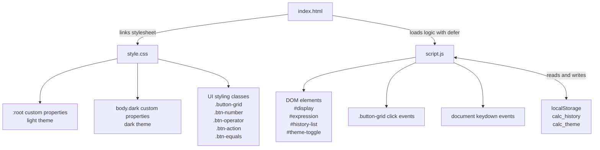
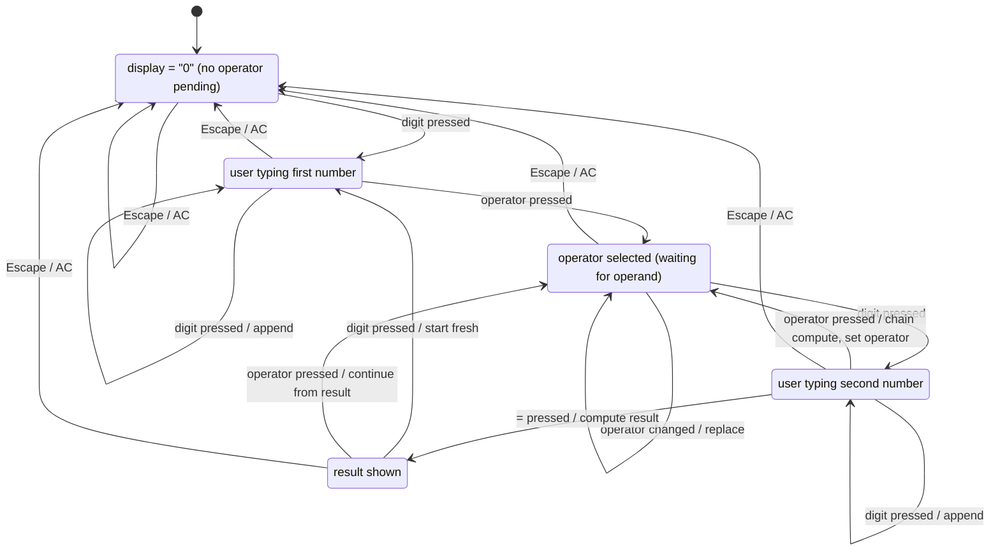
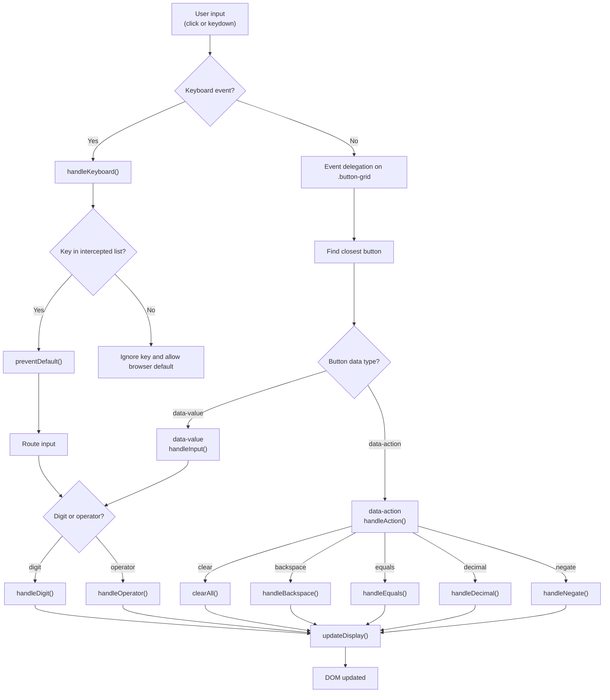
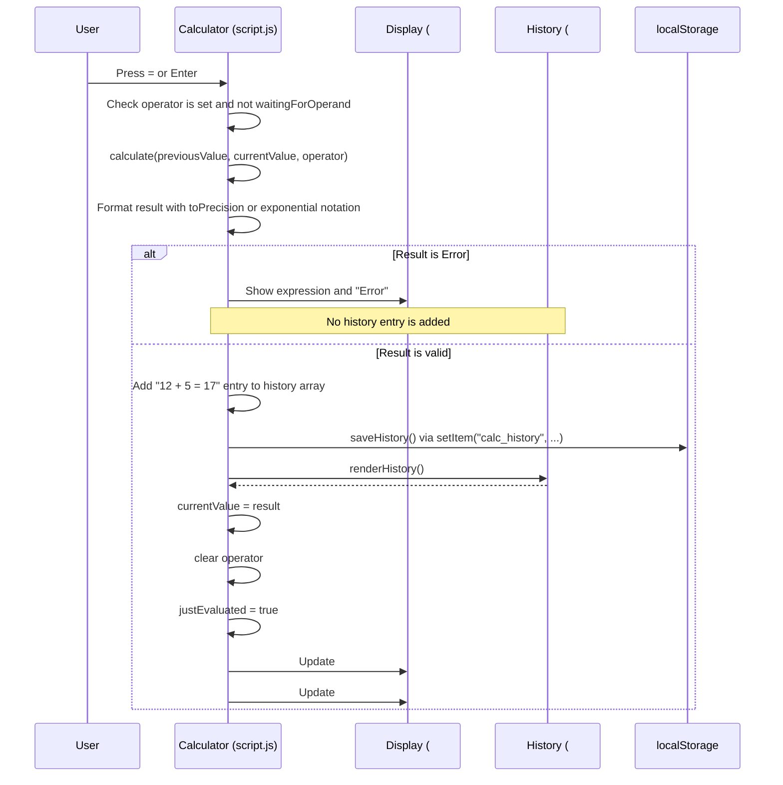
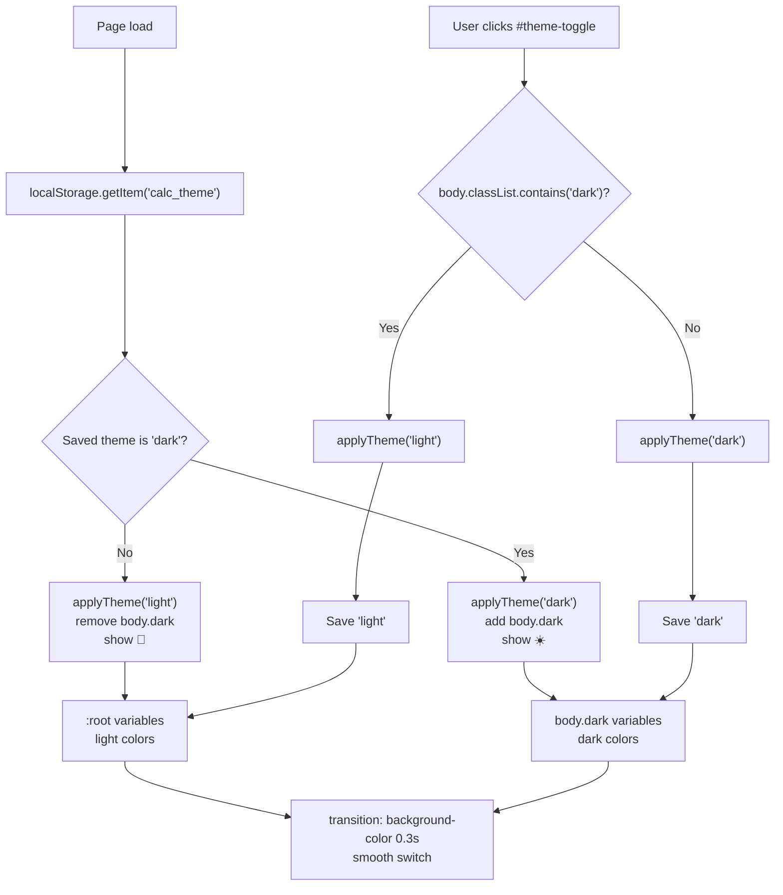

# Calculator — Architecture Diagrams

Mermaid diagrams illustrating how the calculator is structured and how it works.
All diagrams render natively in GitHub markdown.

---

## 1. Project Architecture
This flowchart shows how the HTML, CSS, and JavaScript files connect the UI, behavior, and persistence layers.

## 2. State Machine
This state diagram captures how calculator input moves between number entry, operator selection, evaluation, and reset.

## 3. Input Flow
This flowchart traces both mouse clicks and keyboard events from user input through routing helpers into display updates.

## 4. Equals & History
This sequence diagram shows how pressing equals computes the result, handles errors, and persists successful calculations into history.

## 5. Theme Toggle
This flowchart explains how the saved theme is restored on load, toggled by the user, and reflected through CSS custom properties.

